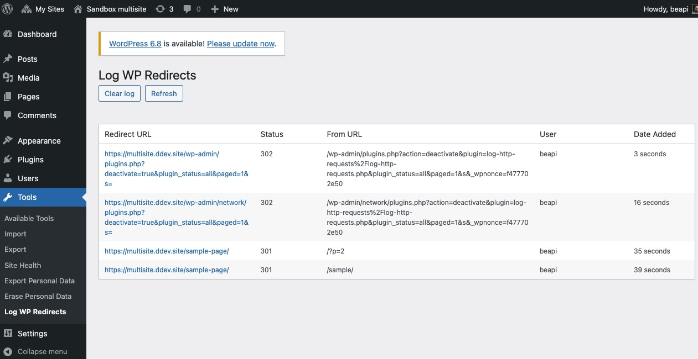
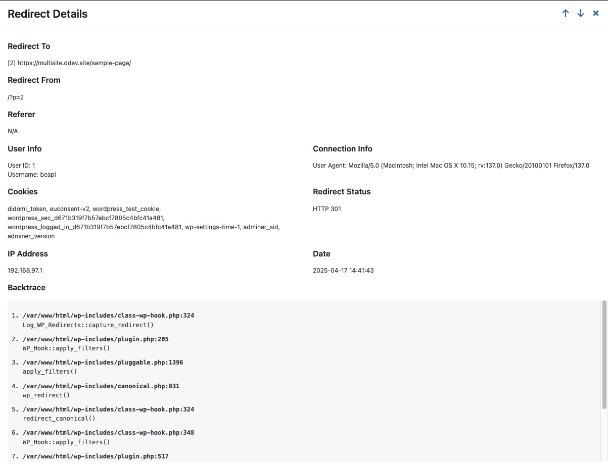
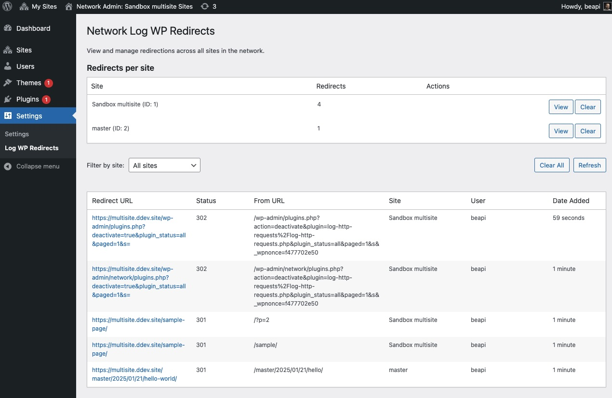

# Log WP Redirects


**Log WP Redirects** is a powerful WordPress plugin that captures and logs all redirects made through WordPress's built-in `wp_redirect()` function, providing valuable insights for debugging and monitoring.

## Features

- 📊 Log all redirects with detailed information
- 🔢 Track HTTP status codes (301, 302, 307, etc.)
- 🔗 Record referrer URLs and request URIs
- 🖥️ Capture user agent information
- 👤 Track user IDs for authenticated users
- 🌐 IP address logging (configurable)
- 🍪 Cookie tracking (names only, not values)
- 🔍 Full backtrace to identify redirect sources
- 🌍 Multisite/Network compatible
- ⏱️ Configurable log retention period

## Screenshots


*Main settings page showing the redirect log interface.*


*Detailed view of a specific redirect with complete stack trace.*


*Network admin interface for managing redirects across multiple sites.*

## Installation

1. Upload the `log-wp-redirects` folder to your `/wp-content/plugins/` directory
2. Activate the plugin through the 'Plugins' menu in WordPress
3. For single sites, access logs via Tools > Log WP Redirects
4. For multisite, access network-wide logs via Network Admin > Settings > Log WP Redirects

## Usage

After installing and activating the plugin, it automatically begins capturing all redirects made using WordPress's `wp_redirect()` function.

### Single Site

1. Go to Tools > Log WP Redirects in your WordPress admin
2. View the comprehensive list of all redirects
3. Click on a redirect to view detailed information including backtrace

### Multisite

1. Go to Network Admin > Settings > Log WP Redirects
2. View redirects across all sites or filter by specific site
3. Click on a redirect to view detailed information

## Hooks & Filters

### `lwr_expiration_days`

Customize how long logs are kept before being automatically deleted:

```php
add_filter( 'lwr_expiration_days', function( $days ) {
    return 14; // default = 7
});
```

### `lwr_should_log_redirect`

Filter which redirects should be logged based on status code or other criteria:

```php
// Example: Don't log 302 temporary redirects
add_filter( 'lwr_should_log_redirect', function( $should_log, $status, $location, $redirect_data ) {
    if ( 302 === $status ) {
        return false;
    }
    return $should_log;
}, 10, 4 );
```

### `lwr_pre_insert_data`

Modify the data before it's inserted into the database:

```php
// Example: Remove all cookies information for privacy
add_filter( 'lwr_pre_insert_data', function( $data, $location, $status ) {
    // Empty the cookies field
    $data['cookies'] = '';
    
    // Or you could also sanitize/modify other fields
    // $data['user_agent'] = 'Anonymized';
    
    return $data;
}, 10, 3 );
```

## Privacy Considerations

This plugin logs IP addresses by default. If you need to comply with privacy regulations such as GDPR, you can disable IP logging by defining the following constant in your wp-config.php:

```php
define('LWR_LOG_IP', false);
```

## Requirements

- WordPress 5.8 or higher
- PHP 7.0 or higher

## License

This project is licensed under the GPLv2 or later license.

## Changelog

### 1.0.2
- Added support for the `$x_redirect_by` parameter of wp_redirect() function
- The source of redirects is now tracked and displayed in the admin interface
- Enhanced database structure to accommodate the new data
- Improved database schema management using WordPress's dbDelta() function
- Added new filter `lwr_pre_insert_data` to modify data before database insertion
- Increased field size for x_redirect_by from 100 to 255 characters

### 1.0.1
- Added new filter `lwr_should_log_redirect` to control which redirects are logged
- Improved code documentation

### 1.0.0
- Initial release

## Credits

Developed by [Be API](https://beapi.fr) 